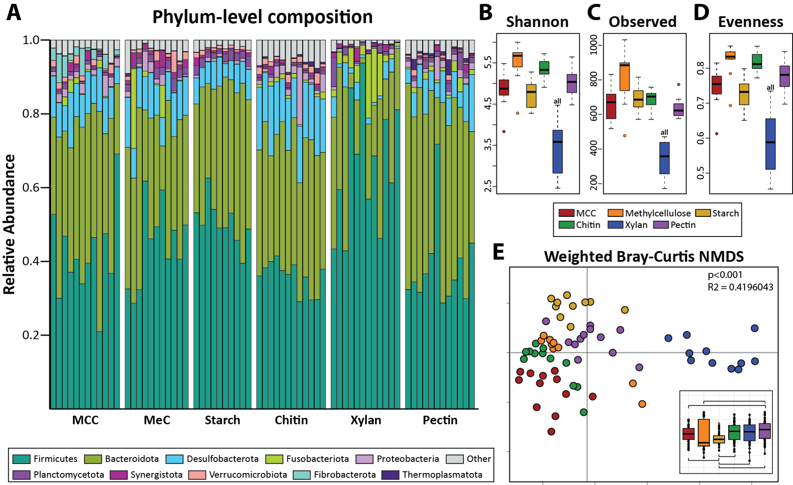
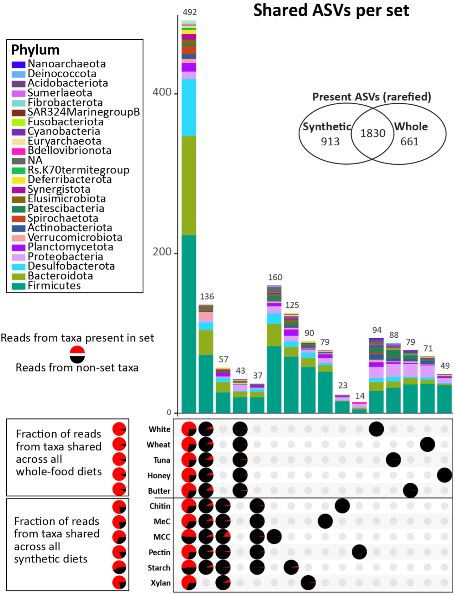

### Research has identified some gut microbes with tenuous associations to health or pathology, but ultimately, the complex nature of our gut microbiome introduces a plethora of factors that may be out of our control. That is not to say we have NO control! The gut microbiome exists within the host organism, putting the host in control of what gets in, who is allowed to stay, and what constraints the microbial community must operate under. 

 

#### Our clearest tool for controlling the microbial community is via nutrients and organic compounds we introduce to the community, AKA diet. While we may understand how high fiber diets increase fibrolytic bacteria and consuming milk protein encourages *Lactococcus* growth, predicting the overall community response to a diet shift is a far more difficult endeavor. 

 

#### **I have created synthetic diets that allow us to control more precisely what enters the gut system and test how different nutrients lead to microbial shifts. My first experiment used different carbohydrate sources and found that, while general “high fiber” diets that are poorly defined had few differences in previous experiments, the exact fiber matters!** 

   

#### Subsequent experiments using these diets continue to show that the hemicellulose Xylan substantially alters the gut community. Additionally, it appears that the use of synthetic diets in general allows for the gut community to be more sensitive to diet shifts than whole-food diets which have unpredictable and unbalanced nutrient contents.

  

#### Perhaps the host itself is maintaining gut stability during nutrient stress to keep a wide array of metabolic capabilities depending on what the cockroach encounters. So, I decided to investigate another method of controlling the microbiome: the immune system.

#### Unlike mammals, insects do not have an adaptive immune system. They rely on their innate immune system which is hardcoded into their genes. Pathogens are recognized by their conserved motifs by proteins such as Peptidoglycan Recognition Proteins, or PGRPs. This recognition can also be used to protect certain microbes that are beneficial to the host. What I find especially fascinating is that members of the same microbial genus but belonging to different host gut communities (ex. mouse to cockroach or termite to cockroach) will fail to colonize the non-native host, indicating evolutionarily conserved immune recognition beyond just recognizing general motifs.

#### **I am using RNA Interference (RNAi) to turn off the immune pathways in germ-free cockroaches to see if we can force a non-native community to assemble in the gut. Additionally, this technique may identify other host factors that are maintaining a starvation-like phenotype during whole-food diet treatments and can help us understand how the host contributes to stability.** 

#### This project is still in the early stages, with tons of potential to grow in many directions!

{width=50%}

