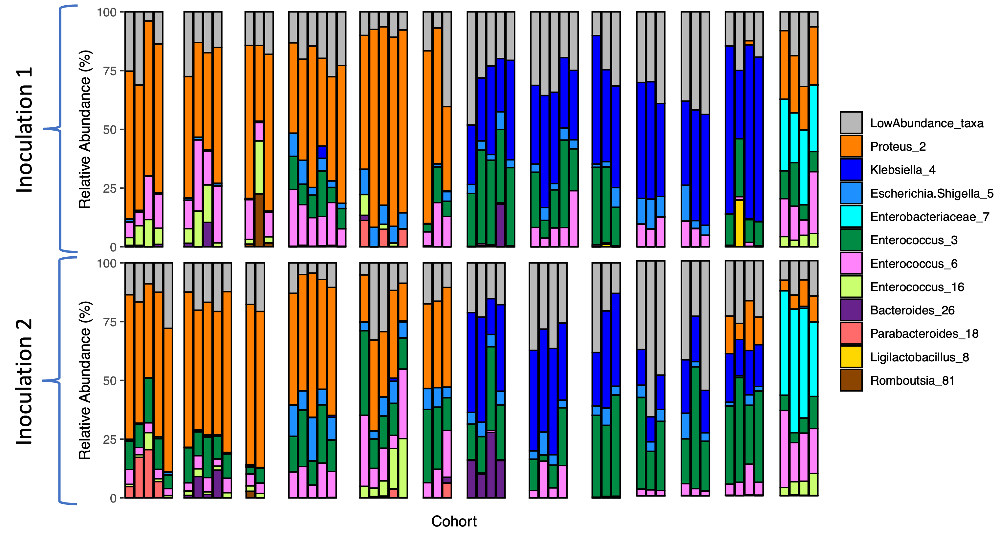
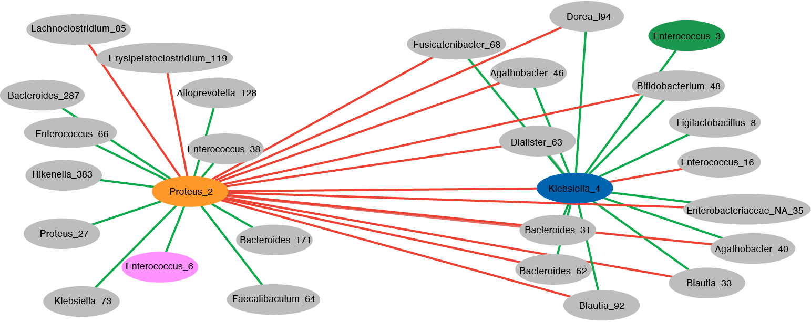
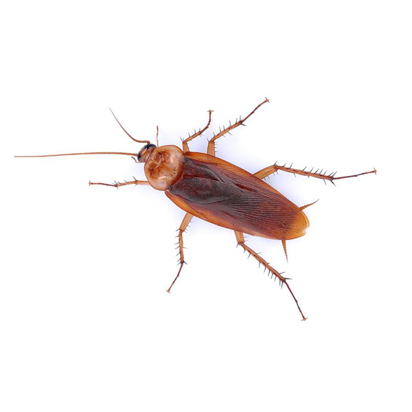

### Observational and experimental studies have linked distinct gut microbial community compositions to host health under a wide variety of conditions.  However, the microbial interactions that drive composition are difficult to test and obscured by microbiome complexity.  Our lab has developed a gnotobiotic cockroach model (*Periplaneta americana*) that allows us to explore these interactions via generation and inoculation of germ-free nymphs with individual organisms as well as undefined microbial consortia.  

  

#### **Inoculation of germ-free nymphs with mouse fecal microbiota results in two distinct, simple communities dominated by *Proteus* or *Klebsiella*, but rarely both.  A second fecal inoculation reveals a degree of community plasticity but rarely caused major changes in dominant community member composition.**

 

**Figure 1:** Relative abundance of sequence variants in gnotobiotic cockroaches inoculated with mouse feces, separated by number of inoculations and by cohort. Cohort is defined as a group of cockroaches hatched from the same egg case (ootheca) and inoculated with the same fecal pellet.

 

##### **Co-occurrence network analysis of 16S data provides a means by which to infer community structure and potential microbe-microbe interactions driving composition.**

 

**Figure 3:** Spearman correlation network of amplicon sequence variants that are significantly correlated to *Klebsiella_4* and/or *Proteus_2* (p < 0.001).  Red edges indicate a negative correlation and green edges indicate a positive correlation.

 

#### **I have isolated the microbes of interest from these communities and am currently testing inferred interactions *in vitro* with rich media and *in vivo* with germ-free cockroach nymphs.**

